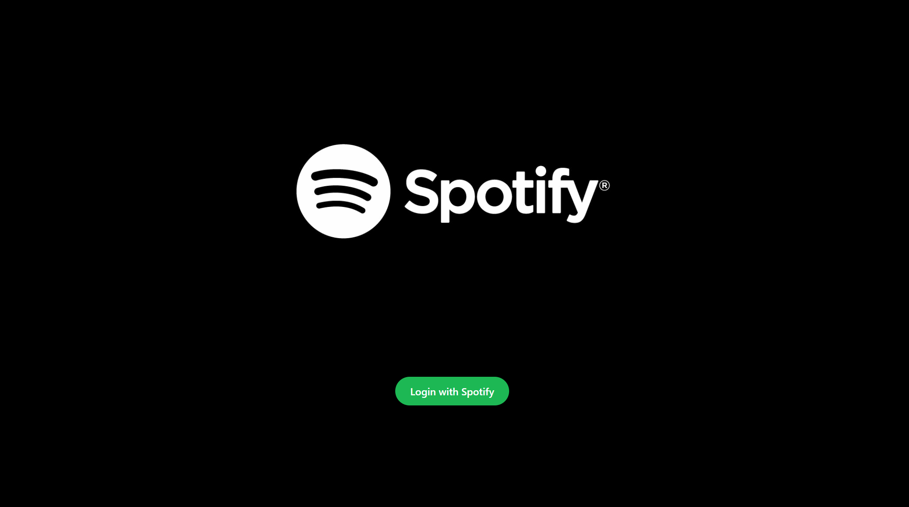

# Spotify 🎧



## Features

1. User can login with their Spotify account.
2. Login user info is shown at the top right side.
3. User's playlist is shown in sidebar.
4. User can click on their playlist and see the songs in the body(center).

### API used:

- Spotify developer's API

### Setup

add `.env` file in root directory

```
REACT_APP_clientId=your-spotify-client-id
REACT_APP_redirectUri=http://localhost:3000/
```

run `npm install` to install the dependencies and run the project with `npm start`
